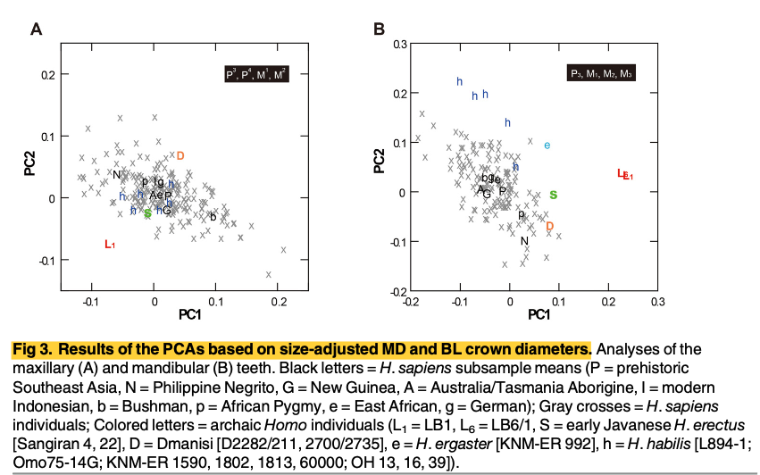

# Introduction
I obtained my data from an article on Plos One called "Unique Dental Morphology of Homo floresiensis and Its Evolutionary Implications." This article examines dental morphologies and traits of Homo florensiensis to determine whether they are comparable to claims that they are more similar to modern humans or to earlier hominins. Comparable "species" for humans involved two categories which were Archaic Homo (including H. erectus, H. habilis sensu lato, Dmanisi, H. ergaster and MP China) and Homo sapiens (including Prehistoric Indonesia, prehistoric Vietnam, Phillipine Negrito, New Guinea, Australian Aborigines, SE Asia, NE Asia, SA Bushman, African Pygmy, South Africa, East Africa, West Africa, India and Europe). 

Before beginning the process of replication, I first had to restructure the dataset that was provided with the publication. This involved removing variables that were irrelevant to the tests I was interested in replicating, as well as creating new variable columns to redefine and simplify existing variables. That is, where specimens were all under one variable column, other variables were added to make the dataset more suitable for analysis rather than for presentation. E.g., in the original dataset where the specimen S1b was classified only under "Archaic Homo," and "Lower Sangiran H. erectus," The new dataset created the "Specimen," "Species," "Class" and "Source" columns to better describe it as S1b (Specimen), Archaic Homo (Class), H. erectus (Species) and Lower Sangirans (Source).


After restructuring the original dataset, I attempted to replicate the author's Principal Component Analysis.

To begin with, I downloaded the supplemental materials and exported the dataset into R using the readxl package and assigned the name "z" to the dataset. I then checked the variables in the datafile using the head() function.


```{r setup, include=TRUE}
f <- "data/S4 Table restructured.xlsx"
library(readxl)
z <- read_excel(f, sheet = 1, col_names = TRUE)
head(z)
```

# Principal Component Analysis
The test I will attempt to replicate here is a descriptive test called the Principal Component Analysis in which the original dataset is transformed into principal components where each one sums up a percentage of the total variation in the dataset.

To begin with, before running the principal component analysis, the authors in the article adjusted the size of the MD and BL crown diameters by dividing them by crown size factor (Kaifu et al., 4). Crown size factor can be defined as the square root of the average crown area for each individual. Or, in other words, the average of all four teeth of one individual when MD x BL. In the article, the authors examined four maxillary and mandibular teeth for each individual. Maxillary teeth included P1, P2, M1 and M2, while mandibular teeth included P1, M1, M2 and M3. Different teeth were used and chosen based on the availability of teeth for the species as well as the extent of wear for H. floresiensis.

# Size Adjusting Maxillary Tooth Diameter with Crown Size Factor (CSF)

Here I adjusted the maxillary tooth diameter by calculating the area for each of the four teeth and then obtaining the average. The average was then divided by the square root and from this, I was able to calculate crown size factor (CSF). I used the mutate function as a part of the dplyr package to create new variable columns in my datafile for later use in my analyses.

```{r}
library(dplyr)
library(ggplot2)
z<-mutate(z,MAXP1AREA=MAXP1MD*MAXP1BL)
z<-mutate(z,MAXP2AREA=MAXP2MD*MAXP2BL)
z<-mutate(z,MAXM1AREA=MAXM1MD*MAXM1BL)
z<-mutate(z,MAXM2AREA=MAXM2MD*MAXM2BL)

z<-mutate(z,MAXAVG=(MAXP1AREA+MAXP2AREA+MAXM1AREA+MAXM2AREA)/4)
z<-mutate(z,MAXCSF=sqrt(MAXAVG))

z<-mutate(z,SAMAXP1MD=MAXP1MD/MAXCSF)
z<-mutate(z,SAMAXP2MD=MAXP2MD/MAXCSF)
z<-mutate(z,SAMAXM1MD=MAXM1MD/MAXCSF)
z<-mutate(z,SAMAXM2MD=MAXM2MD/MAXCSF)


z<-mutate(z,SAMAXP1BL=MAXP1BL/MAXCSF)
z<-mutate(z,SAMAXP2BL=MAXP2BL/MAXCSF)
z<-mutate(z,SAMAXM1BL=MAXM1BL/MAXCSF)
z<-mutate(z,SAMAXM2BL=MAXM2BL/MAXCSF)

```

# Running the Principal Componenent Analysis for Maxillary Tooth Diameters

Now that the crown size factor has been calculated, I selected the size adjusted diameters using the select function from dplyr. It is worth noting that running a principle component analysis WON'T WORK if there are missing or Na values for x, so the na.omit function was used to isolate the measurements of interest. I then calculated the pca using the prcomp() function and viewed it using the summary() function. After calculating the pca scores for maxillary teeth, I reattached some variable columns of each datapoint and extracted the pca scores into a new data frame. Finally, I plotted the first two PCA scores using the pcaplot function. It is worth noting however, the characters of interest were selected for and plotted seperately and then superimposed into one plot using the geom_point function.

```{r}
max <- select(z,SAMAXP1MD,SAMAXP2MD,SAMAXM1MD,SAMAXM2MD,SAMAXP1BL,SAMAXP2BL,SAMAXM1BL,SAMAXM2BL)
new_max <- na.omit(max)
max.pca <- prcomp(new_max, center = TRUE, scale. = TRUE)
summary(max.pca)


t <- select(z,Species,Class,Source,Specimen, SAMAXP1MD,SAMAXP2MD,SAMAXM1MD,SAMAXM2MD,SAMAXP1BL,SAMAXP2BL,SAMAXM1BL,SAMAXM2BL)
z1 <- na.omit(t)
z2 <- as.data.frame(max.pca$x)
z2$Species <- z1$Species
z2$Class <-z1$Class
z2$Source <-z1$Source
z2$Specimen <-z1$Specimen
head(z2)

g <- filter(z2, Class=="Homo sapiens")
L <- filter(z2, Specimen=="LB1R")
l <- filter(z2, Specimen=="LB1L")
S <- filter(z2, Specimen=="S4R+L")
D <- filter(z2, Specimen=="D2700/2735R+L")
h <- filter(z2, Species=="H. habilis sensu lato")

pcaplot <- ggplot(data = g, mapping = aes(x = PC1, y = PC2, shape = Class, 
                                          col = Class, label = Class)) + geom_point(shape=4, color="grey") + geom_point(data=L, shape=76, color="red", size =3) + geom_point(data = l, shape=108, color="red", size =3) + geom_point(data = S, shape=83, color="green", size =3) + geom_point(data = D, shape=68, color="orange", size =3) + geom_point(data = h, shape=104, color="blue", size =3)
pcaplot
```

# Size Adjusting Mandibular Tooth Diameter with Crown Size Factor (CSF)

Similarly, just as before, I calculated the average and divided it by the square root to calculate crown size factor for each mandibular tooth diameter using the mutate function to create new columns and new variables.

```{r}
z<-mutate(z,MANDP1AREA=MANDLP1MD*MANDLP1BL)
z<-mutate(z,MANDM1AREA=MANDLM1MD*MANDLM1BL)
z<-mutate(z,MANDM2AREA=MANDLM2MD*MANDLM2BL)
z<-mutate(z,MANDM3AREA=MANDLM3MD*MANDLM3BL)

z<-mutate(z,MANDAVG=(MANDP1AREA+MANDM1AREA+MANDM2AREA+MANDM3AREA)/4)
z<-mutate(z,MANDCSF=sqrt(MANDAVG))

z<-mutate(z,SAMANDP1MD=MANDLP1MD/MANDCSF)
z<-mutate(z,SAMANDM1MD=MANDLM1MD/MANDCSF)
z<-mutate(z,SAMANDM2MD=MANDLM2MD/MANDCSF)
z<-mutate(z,SAMANDM3MD=MANDLM3MD/MANDCSF)

z<-mutate(z,SAMANDP1BL=MANDLP1BL/MANDCSF)
z<-mutate(z,SAMANDM1BL=MANDLM1BL/MANDCSF)
z<-mutate(z,SAMANDM2BL=MANDLM2BL/MANDCSF)
z<-mutate(z,SAMANDM3BL=MANDLM3BL/MANDCSF)

```

# Running the Principal Componenent Analysis for Mandibular Tooth Diameters

Once again, I selected for the variables of interest to run the principal component analysis and created a pca plot using the ggplot function from the ggplot2 package.


```{r}
mand <- select(z,SAMANDP1MD,SAMANDM1MD,SAMANDM2MD,SAMANDM3MD,SAMANDP1BL,SAMANDM1BL,SAMANDM2BL,SAMANDM3BL)
new_mand <- na.omit(mand)
mand.pca <- prcomp(new_mand, center = TRUE, scale. = TRUE)
summary(mand.pca)


t2 <- select(z,Species,Class,Source,Specimen,SAMANDP1MD,SAMANDM1MD,SAMANDM2MD,SAMANDM3MD,SAMANDP1BL,SAMANDM1BL,SAMANDM2BL,SAMANDM3BL)
z3 <- na.omit(t2)
z4 <-  as.data.frame(mand.pca$x)
z4$Species <- z3$Species
z4$Class <- z3$Class
z4$Source <- z3$Source
z4$Specimen <-z3$Specimen
head(z4)


g1 <- filter(z4, Class=="Homo sapiens")
L1 <- filter(z4, Specimen=="LB1R")
l1<- filter(z4, Specimen=="LB1L")
S1 <- filter(z4, Specimen=="S4R+L")
D1 <- filter(z4, Specimen=="D2700/2735R+L")
h1 <- filter(z4, Species=="H. habilis sensu lato")


pcaplot <- ggplot(data = g1, mapping = aes(x = PC1, y = PC2, shape = Class, 
                                          col = Class, label = Class)) + geom_point(shape=4, color="grey") + geom_point(data=L1, shape=76, color="red", size =3) + geom_point(data = l1, shape=108, color="red", size =3) + geom_point(data = S1, shape=83, color="green", size =3) + geom_point(data = D1, shape=68, color="orange", size =3) + geom_point(data = h1, shape=104, color="blue", size =3)
pcaplot

```


# Mann-Whitney U Test with Bonferroni Correction

After running the principal component analysis, I chose to do a Mann-Whitney U Test with Bonferroni Correction as my inferential statistic. In the article, the authors focused specifically on the PCA scores between the early Javanese H erectus and H. habilis specimens. In running a Mann-Whitney U Test, it is important to note that the purpose of this test is to compare a dependent variable in two independent groups to see if there is a difference (Karadimitriou and Marshall). The dependent variable then, must be continuous while the independent variable must be binary. In this case, the dependent variable are the PCA scores while the Binary Independent variables are either H erectus or H. habilis.

In this test, we will also be running a Bonferroni correction of the p-value from the Mann-whitney U test. This means that the p-value will be adjusted by multiplying it by the number of comparisons (R Documentation). 
So, to begin with, the Mann-Whitney Test can be run using the wilcox.test() function which conducts the U Test by default. Since we are only interested in H erectus and H. habilis, I first assigned a dataset to the letter w which will serve as the data for the test and then specified my dependent and independent variables.
After running the Mann-whitney tests, I assigned all the pvalues for each into a vector called "pvalues" and conducted the bonferroni correction using the p.adjust function.

In the article, while the authors did not present their results, they did describe how H. erectus and H. habilis differed significantly in MD and BL teeth (Kaifu et. al, 8). However, in attempting to replicate these results, only one value appeared significant in maxillary pca analysis before bonferroni correction.

```{r}
w <- z2[3:12,]

wilcox.test(PC1 ~ Species, data=w)
wilcox.test(PC2 ~ Species, data=w)
wilcox.test(PC3 ~ Species, data=w)
pvalues <- c(0.1778, 0.04444, 0.8889)

p.adjust(pvalues, method = "bonferroni")

w2 <- z4[5:10,]

wilcox.test(PC1 ~ Species, data=w2)
wilcox.test(PC2 ~ Species, data=w2)
wilcox.test(PC3 ~ Species, data=w2)

pvalues2 <- c(0.3333, 1, 0.3333)
p.adjust(pvalues2, method = "bonferroni")
```

# Summary

When compared to the article itself, I was not able to exactly replicate the authors' pca plot due in part likely to differing pca scores. As a result, the distribution of the points were more spread out as opposed to the article's more localized distribution of the data. Additionally, this may have also contributed to the differing results in the Mann-Whitney p-values and bonferroni correction analyses. In brief, since we do not know the structure of their original dataset, it could be possible that the restructing of our data did not match the categorization or variables used by the authors.




```{r}

```

# References:
Kaifu et. al. "Unique Dental Morphology of Homo floresiensis and Its Evolutionary Implications." Plos One. 2015.

Principal Component Analysis Module https://difiore.github.io/applied-data-analysis-s2019/PCA/PCA.html

Karadimitriou and Marshall. Stats Tutor. https://www.sheffield.ac.uk/polopoly_fs/1.714563!/file/stcp-karadimitriou-MannWhitR.pdf

R Documentation
https://www.rdocumentation.org/packages/stats/versions/3.6.1/topics/p.adjust